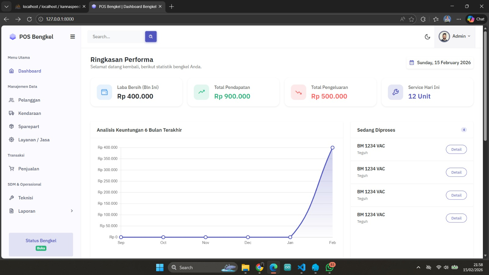
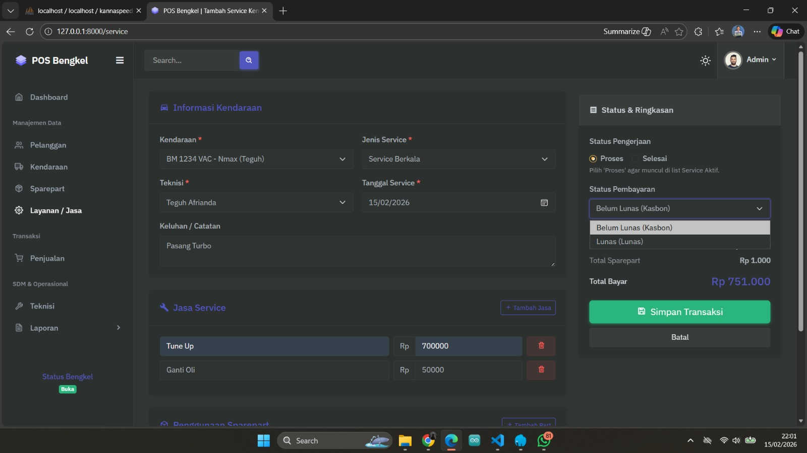

POS Bengkel - Sistem Manajemen Bengkel Motor
Aplikasi Point of Sale (POS) khusus bengkel motor yang dibangun menggunakan Laravel dan Livewire. Sistem ini dirancang untuk memudahkan pemilik bengkel dalam mengelola data pelanggan, inventaris sparepart, hingga pemantauan performa bisnis secara real-time.

🚀 Fitur Utama

1. Dashboard Statistik (Real-time Analytics)
   Ringkasan Performa: Pantau Laba Bersih, Total Pendapatan, dan Total Pengeluaran bulanan secara instan.

Statistik Harian: Menampilkan jumlah unit kendaraan yang diservis setiap hari.

Grafik Analisis Keuntungan: Visualisasi tren keuntungan dalam 6 bulan terakhir untuk membantu pengambilan keputusan bisnis.

Monitoring Status: Daftar kendaraan yang sedang diproses untuk manajemen antrean yang lebih baik.

2. Manajemen Data Master
   Data Pelanggan & Kendaraan: Penyimpanan basis data pemilik kendaraan beserta detail unitnya.

Inventaris Sparepart: Pengelolaan stok suku cadang bengkel.

Layanan / Jasa: Pengaturan daftar jasa servis (misal: Tune Up, Ganti Oli) beserta harganya.

3. Modul Transaksi & Layanan
   Input Jasa Service: Pencatatan teknisi yang bertugas, jenis servis, serta keluhan pelanggan (misal: "Pasang Turbo").

Penggunaan Sparepart: Integrasi otomatis antara pemakaian suku cadang dengan total biaya transaksi.

Status Pengerjaan: Pelacakan status unit secara dinamis (Proses atau Selesai).

Sistem Pembayaran Flexible: Mendukung status pembayaran "Lunas" maupun "Belum Lunas (Kasbon)".

4. SDM & Operasional
   Manajemen Teknisi: Pengelolaan data mekanik/teknisi bengkel.

Laporan Komprehensif: Akses cepat ke laporan keuangan dan aktivitas operasional bengkel.

Status Bengkel: Indikator status buka/tutup bengkel pada sidebar.

🛠️ Teknologi yang Digunakan
Framework: Laravel

Frontend: Livewire, Tailwind CSS (atau Bootstrap sesuai UI)

Database: MySQL

Icons: FontAwesome / Boxicons

## 📸 Tampilan Aplikasi

### Dashboard Performa

Menampilkan statistik laba, pendapatan, pengeluaran, serta grafik analisis bulanan.

### Form Transaksi Service

Pencatatan data kendaraan, teknisi, jasa service, hingga status pembayaran.

Cara Instalasi (Opsional)
Clone repository: git clone https://github.com/teguhafrianda/Pos_Bengkel.git

Install dependencies: composer install & npm install

Copy .env.example ke .env dan sesuaikan database.

Run migration & seed: php artisan migrate --seed

Jalankan server: php artisan serve
